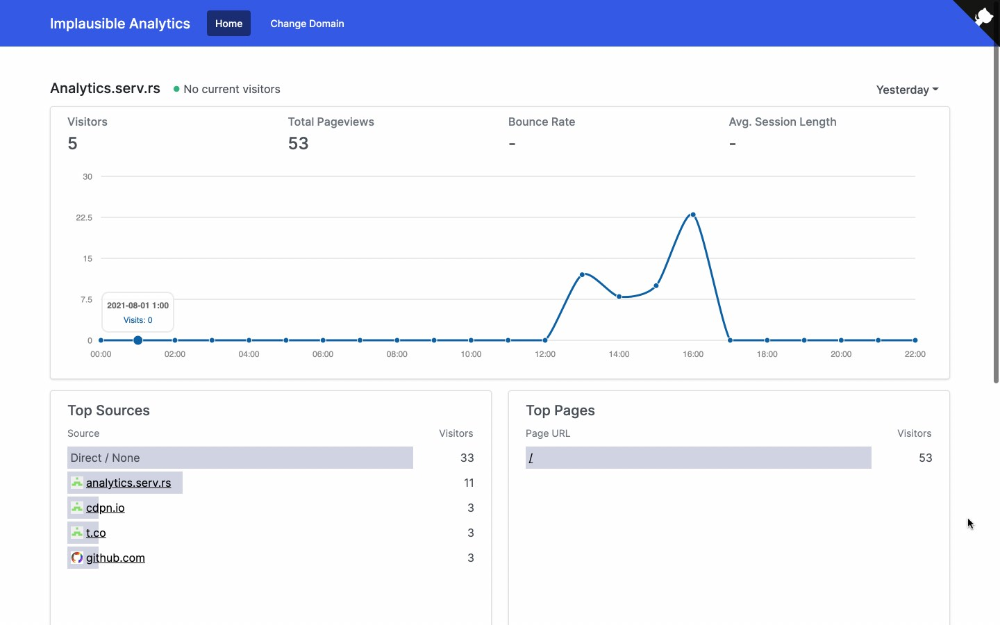

# Implausible Analytics

A simple analytics implementation that collects and serves data from a static CDN, using web workers, WASM, range requests, and some other fun tricks.



## Inspiration

[Hosting SQLite databases on Github Pages](https://phiresky.netlify.app/blog/2021/hosting-sqlite-databases-on-github-pages/) | [Discussion](https://news.ycombinator.com/item?id=28015980)

[Plausible Analytics](https://plausible.io/plausible.io)


## How It Works

1. A ["Snowplow-style Collector"](https://docs.snowplowanalytics.com/docs/getting-started-on-snowplow-open-source/setup-snowplow-on-aws/setup-the-snowplow-collector/) is set up on a CDN (Bunny CDN in our case), to capture traffic data via requests to a transparent image (`o.png`), in our CDN's own log file format.
2. A job runs every 2 hours to download these log files, process them, and output the results in a SQLite database, which is stored statically & accessible to the public via range requests.
3. Our simple frontend uses `sql.js` and [sql.js-httpvfs](https://github.com/phiresky/sql.js-httpvfs) to query `analytics.sqlite3` (which is a static file hosted on a CDN).

Our entire Analytics implementation (collection - storage) is handled by static CDNs.

## Demo

You can view a public demo here:

https://analytics.serv.rs/

## Install on your Own Site

You can install on your own site, and then view your public analytics data on https://analytics.serv.rs/

```html
<script src="https://analytics.serv.rs/a.js"></script>
```

Note: this is a toy project. It might be fun and handle a lot of data, but it isn't well reviewed and probably isn't very accurate or useful.

## Install on your own "servers"

This project runs on [Bunny CDN](https://bunny.net/) and Heroku or Herokuish (Dokku). You could probably tweak it to run anywhere though.

### Setting up the Collector

1. Create a new bucket on Bunny CDN
2. Upload `o.png` (included) to your bucket
3. Add a Pull Zone
4. Copy the Full URL to `o.png`

### Deploying

1. Modify `public/a.js` line `27` to point to the collector you just created (`o.png`).
2. Optional: modify line 72 of `public/src/index.ts` to your own URL & run `webpack` to rebuild.
3. Update your Environment Variables based on the template `env` to include your Bunny CDN pull zone ID and API key. This is required for `npm run build` to run, and parse your log files.
4. Deploy the project
5. Include the script `a.js` on your website somewhere (it's already included in the project you deploy)
6. Optional: set up a cron job to rebuild (`npm run build`) the site every few hours, or day. This will fetch logs and update.

### Using the Self-hosted Version

Go to the project you deployed. Enter the hostname of the website you wish to view analytics for, if you didn't complete step 2 above. 

That's it!

## Todo

- [ ] Setup a GitHub Action to run the batch processing job (instead of doing it on a server) for a "more static, more serverless" experience.
- [ ] Consider implementing High Water Marks for larger projects
